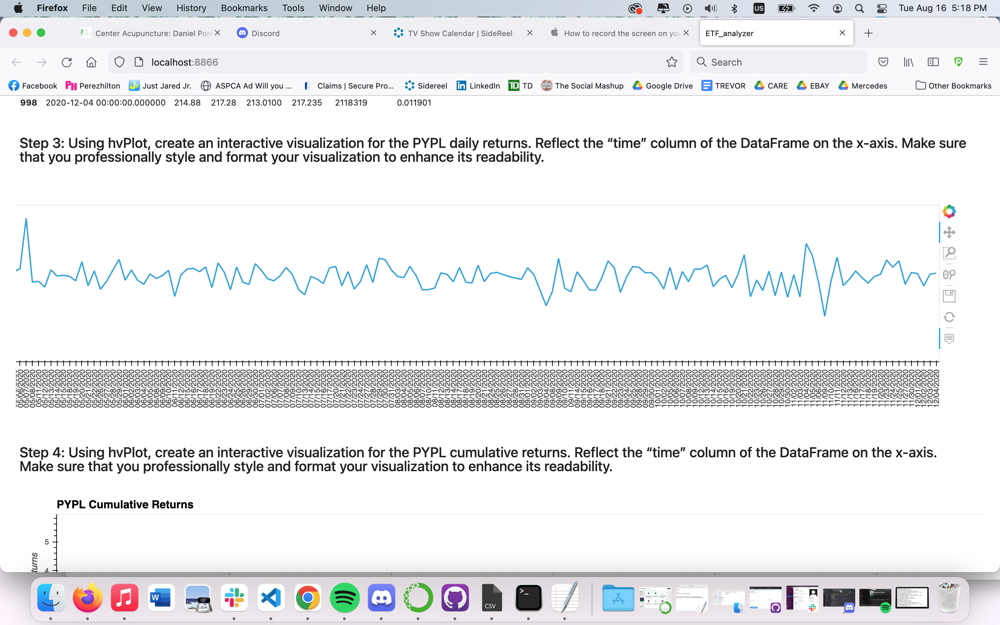

# ETF_analyzer

open ETF_analyzer.ipynb to view the analysis and conclusions. 

Screen Shots of the interactive plots below. For the first two, i stretched the plot width to show every date without overlap, however this wont let you see the entire plot in a screenshot. In the third image, i opted for a an image with only annual x-axis points, in order to show the entire plot in one screen without unsightly overlapping dates on the x-axis.

PYPL Daily Returns:

PYPL Cumulative Returns:

ETF Cumulative Returns:

And proof that the screen shots were taken from a Voila browser:

